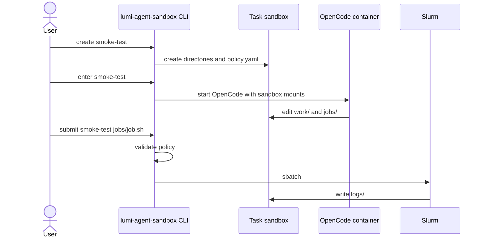

# lumi-agent-sandbox

Small host-side harness for running OpenCode on LUMI inside a disposable task workspace.

It creates one sandbox directory per task, starts the LAIF OpenCode SIF with strict mounts, and submits Slurm jobs only after a small host-side policy check.

## Flow



## Configure

Check `lumi-agent-sandbox.yaml` after cloning. Change these values only if they do not match your LUMI project or OpenCode SIF path:

```yaml
account: project_462000131
agent_image: /appl/local/laifs/agents/sif/opencode.sif
```

The default sandbox root is:

```text
/scratch/<account>/$USER/agent-sandboxes
```

## Install On LUMI

Set these values for the examples below:

```sh
PROJECT=project_462000131
REPO_URL=<repo-url>
```

Run from scratch:

```sh
cd /scratch/$PROJECT/$USER
git clone "$REPO_URL" lumi-agent-sandbox
cd lumi-agent-sandbox
module load cray-python
python3 -m pip install --user -e .
```

## Smoke Test

Create a sandbox:

```sh
lumi-agent-sandbox create smoke-test
```

Example output:

```text
/scratch/project_462000131/<user>/agent-sandboxes/smoke-test
```

Set the sandbox path for the next commands:

```sh
SANDBOX=/scratch/$PROJECT/$USER/agent-sandboxes/smoke-test
```

Create this file:

```text
$SANDBOX/jobs/hostname.sh
```

File content:

```sh
#!/bin/sh
#SBATCH --partition=dev-g
#SBATCH --time=00:02:00
#SBATCH --nodes=1

hostname
pwd
ls -la
```

Submit the job through the sandbox harness:

```sh
lumi-agent-sandbox submit smoke-test jobs/hostname.sh
```

Example output:

```text
Submitted batch job 12345678
```

Check the queue:

```sh
squeue -A "$PROJECT"
```

Inspect logs after the job finishes:

```sh
ls -la "$SANDBOX/logs"
cat "$SANDBOX"/logs/*.out
cat "$SANDBOX"/logs/*.err
```

## Run OpenCode

Start OpenCode inside the sandbox:

```sh
lumi-agent-sandbox enter smoke-test
```

`enter` opens the OpenCode UI. Type prompts in that UI, not in the shell.

For a simple test prompt:

```text
Create jobs/hostname.sh that prints hostname, pwd, and ls -la using partition dev-g and 2 minutes of walltime.
```

Then leave OpenCode and submit from the host shell:

```sh
lumi-agent-sandbox submit smoke-test jobs/hostname.sh
```

## Sandbox Layout

```text
work/        files the agent may edit
input/       read-only input mount inside the container
output/      generated outputs
jobs/        Slurm scripts submitted through lumi-agent-sandbox submit
logs/        Slurm stdout/stderr
state/home/  container home directory
wrappers/    blocked sbatch/srun/salloc commands inside the container
policy.yaml  sandbox account, image, partitions, and resource limits
enter.sh     generated container launch script
```

## Policy

Generated sandboxes allow short, small jobs:

```yaml
defaults:
  partition: dev-g
  time: "00:15:00"
  nodes: 1
  gpus_per_node: 0

limits:
  max_time: "00:30:00"
  max_nodes: 1
  max_gpus_per_node: 1

allowed_partitions:
  - dev-g
  - debug
```

`submit` only accepts scripts inside `jobs/`. It forces Slurm stdout/stderr into `logs/`, rejects job arrays, and rejects obvious references to home directories or broad project/scratch paths outside the sandbox.

## Cleanup

Delete the smoke-test sandbox:

```sh
lumi-agent-sandbox destroy smoke-test --yes
```

## Development

Run tests:

```sh
python3 -m unittest discover -s tests
```
