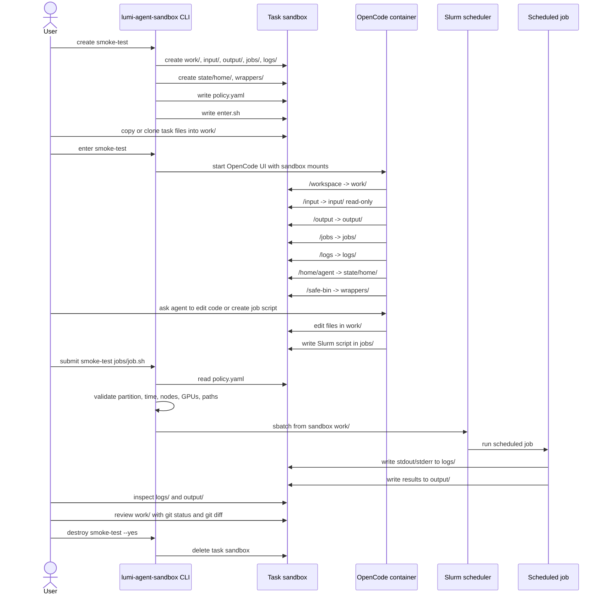

# lumi-agent-sandbox

Small host-side harness for running OpenCode on LUMI inside a disposable task workspace.

It creates one sandbox directory per task, launches the LAIF OpenCode SIF with strict mounts, and submits Slurm jobs only through a host-side policy check.

Site defaults are stored in `lumi-agent-sandbox.yaml`:

```yaml
account: project_462000131
agent_image: /appl/local/laifs/agents/sif/opencode.sif
```

The default sandbox root is `/scratch/<account>/$USER/agent-sandboxes`.
Run commands from the cloned repo directory to use these defaults.

## Quickstart On LUMI

Clone and install:

```sh
cd /scratch/project_462000131/$USER
git clone <your-lumi-agent-sandbox-repo-url> lumi-agent-sandbox
cd lumi-agent-sandbox

module load cray-python
python3 -m pip install --user -e .
```

Create a disposable test sandbox:

```sh
lumi-agent-sandbox create smoke-test
SANDBOX=/scratch/project_462000131/$USER/agent-sandboxes/smoke-test
```

Check the container mounts with a shell:

```sh
lumi-agent-sandbox shell smoke-test
```

Inside that shell, run:

```sh
pwd
echo "$HOME"
ls -la /workspace /input /output /jobs /logs
sbatch --version
srun --version
salloc --version
exit
```

Expected:

- `pwd` is `/workspace`
- `HOME` is `/home/agent`
- `/input` is read-only
- `sbatch`, `srun`, and `salloc` print the sandbox wrapper message

Create a tiny Slurm job:

```sh
cat > "$SANDBOX/jobs/hostname.sh" <<'EOF'
#!/bin/sh
#SBATCH --partition=dev-g
#SBATCH --time=00:02:00
#SBATCH --nodes=1

hostname
pwd
ls -la
EOF
```

Submit it through the sandbox harness:

```sh
lumi-agent-sandbox submit smoke-test jobs/hostname.sh
squeue -A project_462000131
```

After the job finishes:

```sh
ls -la "$SANDBOX/logs"
cat "$SANDBOX"/logs/*.out
cat "$SANDBOX"/logs/*.err
```

Start OpenCode:

```sh
lumi-agent-sandbox enter smoke-test
```

`enter` opens the OpenCode UI. Type agent prompts there. Use `shell` only when you want a normal container shell for mount checks.

## Flow



## Daily Use

For a real task:

```sh
lumi-agent-sandbox create my-task
cd /scratch/project_462000131/$USER/agent-sandboxes/my-task/work
# copy or clone only the files the agent should edit
lumi-agent-sandbox enter my-task
```

Review changes before copying anything back:

```sh
cd /scratch/project_462000131/$USER/agent-sandboxes/my-task/work
git status
git diff
```

Delete a sandbox only when you are done with it:

```sh
lumi-agent-sandbox destroy my-task --yes
```

## Policy

Each sandbox has a `policy.yaml`. The generated default allows short, small jobs:

- max time: `00:30:00`
- max nodes: `1`
- max GPUs per node: `1`
- allowed partitions: `small`, `standard`, `dev-g`, `small-g`, `standard-g`

`submit` accepts only scripts inside the sandbox `jobs/` directory. It forces Slurm stdout/stderr into the sandbox `logs/` directory and rejects obvious references to home directories or broad project/scratch paths outside the sandbox.

Override defaults when needed:

```sh
lumi-agent-sandbox --account project_other create my-task
lumi-agent-sandbox --root /scratch/project_other/$USER/agent-sandboxes create my-task
export LUMI_AGENT_IMAGE=/path/to/other-agent.sif
```

Resolution order is command-line flag, then environment variable, then `lumi-agent-sandbox.yaml` in the current directory.

Run local tests:

```sh
python3 -m unittest discover -s tests
```
