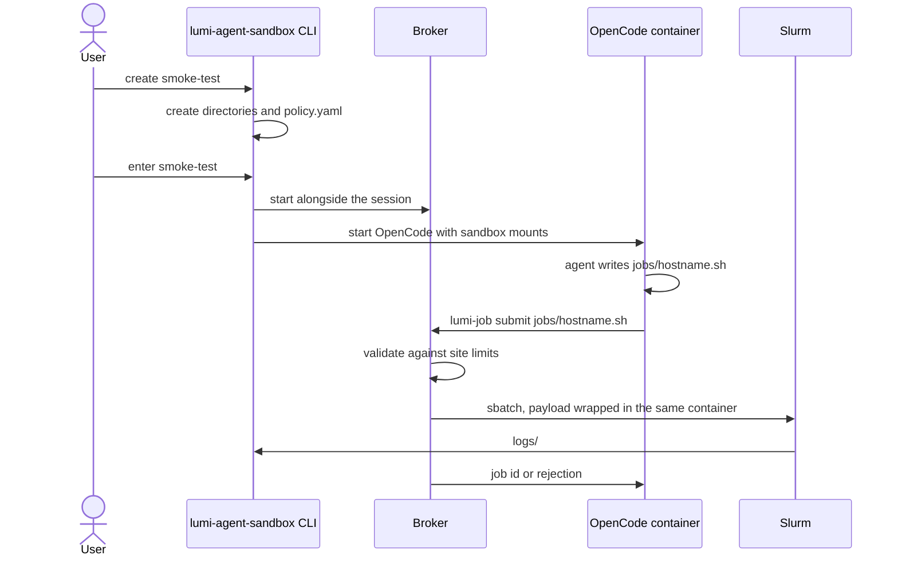

# lumi-agent-sandbox

Small host-side harness for running OpenCode on LUMI inside a disposable task workspace.

It creates one sandbox directory per task, starts the LAIF OpenCode SIF with strict mounts, and lets
the agent submit Slurm jobs through a host-side broker that holds the credentials and enforces the
site's resource limits.

## Flow


```mermaid
sequenceDiagram
    actor User
    participant CLI as lumi-agent-sandbox CLI
    participant Broker
    participant Container as OpenCode container
    participant Slurm

    User->>CLI: create smoke-test
    CLI->>CLI: create directories and policy.yaml
    User->>CLI: enter smoke-test
    CLI->>Broker: start alongside the session
    CLI->>Container: start OpenCode with sandbox mounts
    Container->>Container: agent writes jobs/hostname.sh
    Container->>Broker: lumi-job submit jobs/hostname.sh
    Broker->>Broker: validate against site limits
    Broker->>Slurm: sbatch, payload wrapped in the same container
    Slurm->>CLI: logs/
    Broker->>Container: job id or rejection
```

The agent never holds a Slurm or API credential. It writes a request into `requests/`; the broker
validates it, copies the script somewhere the agent cannot reach, and submits that copy.

## Configure

Check `lumi-agent-sandbox.yaml` after cloning. This is the **site policy** and it is authoritative:
a sandbox's own `policy.yaml` may only narrow these limits, never loosen them.

```yaml
account: project_462000131
agent_image: /appl/local/laifs/agents/sif/opencode.sif
profile: standard
job_execution: container
require_enforced_egress: false
container_command: singularity   # apptainer on CSC's own systems
gpu_flag: --rocm                 # --nv for NVIDIA

limits:
  allowed_partitions: [dev-g, debug]
  max_nodes: 1
  max_gpus_per_node: 1
  max_time: "00:30:00"
  max_jobs_per_session: 10
  max_node_hours_per_session: 2
```

Quote every walltime. Bare `12:00:00` is sexagesimal in YAML and loads as the integer `43200`; the
harness rejects that rather than silently applying a limit 60x looser than written.

For a managed deployment, put this file somewhere users cannot edit and point at it with
`--site-config` or `$LUMI_AGENT_SANDBOX_SITE`. Search order is `--site-config`,
`$LUMI_AGENT_SANDBOX_SITE`, `/appl/local/laifs/lumi-agent-sandbox/site.yaml`, then the repo file.

The default sandbox root is:

```text
/scratch/<account>/$USER/agent-sandboxes
```

## Install On LUMI

```sh
PROJECT=project_462000131

cd /scratch/$PROJECT/$USER
git clone https://github.com/aniskhan25/lumi-agent-sandbox.git
cd lumi-agent-sandbox
module load cray-python
python3 -m pip install --user -e .
```

## Smoke Test

Create a sandbox:

```sh
lumi-agent-sandbox create smoke-test
SANDBOX=/scratch/$PROJECT/$USER/agent-sandboxes/smoke-test
```

Create a tiny Slurm job:

```sh
cat > "$SANDBOX/jobs/hostname.sh" <<'EOF'
#!/bin/sh
#SBATCH --partition=dev-g
#SBATCH --time=00:02:00

hostname
pwd
ls -la
EOF
```

Submit it from the host:

```sh
lumi-agent-sandbox submit smoke-test jobs/hostname.sh
```

Check the queue and the logs:

```sh
squeue -u "$USER"
cat "$SANDBOX"/logs/*.out
```

## Run OpenCode

```sh
lumi-agent-sandbox enter smoke-test
```

`enter` starts the broker and opens the OpenCode UI. Type prompts in that UI, not in the shell.
A test prompt:

```text
Write jobs/hostname.sh that prints hostname, pwd and ls -la on partition dev-g with 2 minutes of
walltime, then submit it with: lumi-job submit jobs/hostname.sh
```

Inside the container the agent has `lumi-job` on its `PATH`:

```text
lumi-job submit jobs/train.sh [--partition dev-g] [--time 00:10:00] [--nodes 1] [--gpus 1]
lumi-job status <job-id>
lumi-job cancel <job-id>
```

`status` and `cancel` only act on jobs this sandbox submitted. Without that check the agent could
ask the broker to cancel any job belonging to you, including work unrelated to the sandbox. The same
commands exist on the host as `lumi-agent-sandbox status|cancel <task> <job-id>`.

`sbatch`, `srun` and `salloc` are not available there. Pass `--no-broker` to `enter` to run a session
where the agent cannot submit at all, or run the broker in its own terminal with
`lumi-agent-sandbox broker smoke-test`.

## Sandbox Layout

```text
work/            files the agent may edit, and the container's working directory
input/           read-only input mount
output/          generated outputs
jobs/            Slurm scripts the agent writes
requests/        the agent's job requests and the broker's replies
logs/            Slurm stdout/stderr
audit/           manifest, broker log, job records, staged scripts, verification
agent/           generated OpenCode config (private profile only)
state/home/      container home directory
wrappers/        lumi-job, and blocked sbatch/srun/salloc
policy.yaml      account, image, and any limits that narrow the site policy
enter.sh         generated container launch script
```

`audit/` is deliberately not mounted into the container: it holds the copy of each script that was
actually submitted, so the agent cannot change a script after it passed validation.

## What The Broker Enforces

Every request, whether from `lumi-job` or `lumi-agent-sandbox submit`, must pass:

- the script resolves to a real file inside `jobs/`;
- the request carries only known fields;
- partition, walltime, nodes and GPUs are within the effective limits;
- no job arrays, and no account other than the sandbox's;
- the session's job count and node-hour budget still have room.

Under `job_execution: container` the job payload runs inside the agent image with the agent's own
mounts, so `$HOME`, other projects and the wider `/scratch` are unreachable rather than filtered out
of the script text. GPU jobs get `--rocm`. The container sees no `SLURM_*` variables, which is the
cost of that isolation; set `job_execution: host` if a workload needs the host environment, and note
that the boundary then falls back to an advisory text scan.

## Private Profile

`profile: private` also constrains what the agent itself can do, by generating an OpenCode
configuration from the site policy:

```yaml
profile: private

agent:
  provider:
    id: csc-internal
    base_url: https://<csc-inference-endpoint>/v1
    models: [<model-id>]
  deny_tools: [webfetch, websearch]
  mcp:
    lumi-docs:
      type: local
      command: [lumi-docs-mcp]
```

Writing that config into the container is not enough on its own. OpenCode merges config from several
places and later wins, so the project's own `opencode.json` overrides anything global — and
`.opencode/plugin*/*.ts` is auto-discovered and *executed*, from a directory the agent can write.
So the lockdown is three things together:

- the generated config is bound read-only at `/etc/opencode/opencode.json`, the managed config
  directory, which outranks project config;
- `OPENCODE_DISABLE_PROJECT_CONFIG=1`, the only thing that stops project config and the plugin
  directory being read at all;
- `OPENCODE_PERMISSION`, which is applied last of everything.

The last two are undocumented upstream, so `verify` tests them rather than assuming them. Verified
against opencode v1.18.31.

`require_enforced_egress: true` makes startup fail unless real egress enforcement exists. It does not
today, so that flag currently refuses to start — which is the point: the harness never reports a
guarantee it cannot keep.

## FirecREST Backend

`backend: firecrest` makes the broker submit through CSC's HPC API instead of calling `sbatch`
locally. Nothing else changes: the same policy, staging, budget and containment apply, because the
backend is only the last step.

```yaml
backend: firecrest

firecrest:
  url: https://api.lumi.csc.fi/v1
  system: lumi
  token_url: https://user-auth.csc.fi/idp/profile/oidc/token
```

Credentials live in the **broker's** environment and nowhere else. Two forms:

```sh
# robot account: exchanged for a token and refreshed automatically
export FIRECREST_CLIENT_ID=... FIRECREST_CLIENT_SECRET=...

# or a personal 24-hour token from https://my.csc.fi/firecrest-token, used as-is
export FIRECREST_TOKEN=eyJ...
```

`FIRECREST_TOKEN` wins if both are set. Nothing is written to disk or into the sandbox, and
`--cleanenv --containall` means the agent's container sees neither. Never put either in a site
config file — those are committed to this repo.

A personal token cannot be refreshed, so it simply starts returning 401 after 24 hours; the client
says so rather than reporting a bare authentication failure. `inspect` reports which form is in use,
never the value. Robot accounts are not self-service — mail servicedesk@csc.fi.

One thing worth knowing about the API: `JobDescriptionModel` has **no fields for walltime, nodes or
GPUs**. Those can only be expressed as `#SBATCH` directives in the script. So the broker writes the
validated directives into the generated wrapper and strips the agent's own — otherwise a backend that
reads limits from the script would see a second, unchecked set. The Slurm backend gets the same
wrapper, where the directives are simply redundant with the command-line flags.

Implemented on stdlib `urllib`, not `pyfirecrest`: the surface needed is four calls, while the client
library would take this package from one dependency to roughly fifteen. Reconsider that if bulk data
staging through S3/Allas is ever needed, which is the fiddly part of the API.

### Testing on Roihu

Roihu is where CSC actually documents FirecREST, and where robot accounts are documented to use it,
so it is the better place to validate this path first. `site-roihu.yaml` is a worked config; nothing
in the code changes, because the two deployments serve byte-identical OpenAPI specs apart from
`servers`.

What differs is all configuration: `https://api.roihu.csc.fi/v1`; system names `cpu` / `gpu` /
`gpu-login1` rather than a single `lumi`; partitions `test` / `small` / `interactive`; `apptainer`
instead of `singularity`; and `--nv` instead of `--rocm`, since Roihu is NVIDIA GH200.

It starts at `job_execution: host`, because contained execution needs an OpenCode image on Roihu and
there is no LAIF equivalent there. The FirecREST client can be validated without one:

```sh
export FIRECREST_CLIENT_ID=... FIRECREST_CLIENT_SECRET=...
lumi-agent-sandbox --site-config site-roihu.yaml create smoke
lumi-agent-sandbox --site-config site-roihu.yaml submit smoke jobs/hostname.sh --dry-run
lumi-agent-sandbox --site-config site-roihu.yaml submit smoke jobs/hostname.sh
```

Caveats, both outside this repo:

- CSC documents FirecREST for Roihu only, and LUMI's own docs have no FirecREST page at all. The LUMI
  endpoint is live and serves its own OpenAPI spec, but treat it as under-documented and confirm with
  CSC before depending on it.
- CSC's account docs still prescribe SSH keys for LUMI robot accounts. Whether LUMI robot accounts
  are provisioned for FirecREST today is unconfirmed.

## Inspect And Verify

```sh
lumi-agent-sandbox inspect smoke-test    # what this sandbox does, and what it does not enforce
lumi-agent-sandbox verify smoke-test     # actively test it; writes audit/verification.json
```

`inspect` ends with a "Not enforced" section listing the gaps: unconfined outbound network, a site
policy that is only a deployment control when users can edit it, and the fact that the OpenCode
lockdown binds the session `enter` starts rather than every process the agent could launch. Read it
adversarially; it is meant to under-claim.

`verify` grades what it can test and skips what it cannot, rather than reporting an untested
assumption as a pass. Checks that need the container are skipped when Singularity or the image is
unavailable. The egress probe is reported as an observation, never as a pass, because nothing here
can enforce it.

`create` writes `audit/manifest.json`: harness version and commit, image path and SHA-256, effective
limits and their hash, model endpoint, denied tools, MCP servers and the mount list. No prompts and
no source code — it records the boundary, not the work.

## Cleanup

```sh
lumi-agent-sandbox destroy smoke-test --yes
```

The audit trail is copied to `<root>/.audit/<task>-<timestamp>/` first. An audit record deleted with
the thing it describes is not an audit record.

## Development

```sh
python3 -m unittest discover -s tests
```
